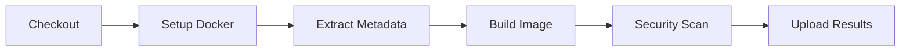
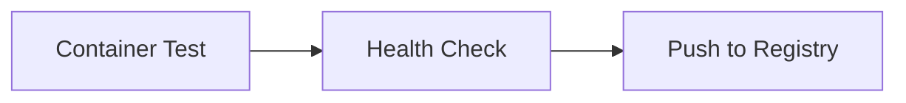
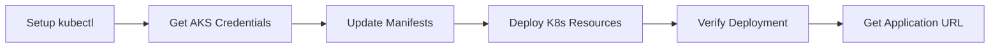

# Build and Deploy Pipeline

This repository contains a unified CI/CD pipeline that builds, tests, scans, and deploys the Material Dashboard React application to Azure AKS.

## Pipeline Overview

The `build-and-deploy.yml` workflow is a single, comprehensive pipeline that performs:

### 🔄 Build Phase
- **Checkout code** from the repository
- **Set up Docker Buildx** for multi-platform builds
- **Extract metadata** for image tagging
- **Build Docker image** with optimized caching

### 🔒 Security Phase
- **Trivy vulnerability scanning** for CRITICAL and HIGH severity issues
- **Upload SARIF results** to GitHub Security tab
- **Artifact storage** for scan results (30-day retention)

### 🧪 Testing Phase
- **Container testing** to verify the built image runs correctly
- **Health checks** to ensure the application responds
- **Log analysis** for debugging purposes

### 📦 Registry Phase
- **Push Docker image** to GitHub Container Registry (ghcr.io)
- **Multi-tag strategy** with branch, SHA, and latest tags

### 🚀 Deployment Phase (Main branch only)
- **Azure AKS authentication** using service principal
- **Kubernetes manifest updates** with new image tags
- **Sequential deployment** of all Kubernetes resources
- **Deployment verification** and status checks
- **URL generation** for accessing the deployed application

## Triggers

The pipeline runs on:
- **Push** to `main` or `develop` branches
- **Pull requests** to `main` branch
- **Manual dispatch** via GitHub Actions UI

## Environment Variables

```yaml
REGISTRY: ghcr.io
IMAGE_NAME: javascript-app
AZURE_RESOURCE_GROUP: javascript-rg
AKS_CLUSTER_NAME: javascript-aks
NAMESPACE: javascript-namespace
```

## Required Secrets

Set these secrets in your GitHub repository settings:

### Azure Credentials
```json
{
  "clientId": "your-service-principal-client-id",
  "clientSecret": "your-service-principal-client-secret",
  "subscriptionId": "your-azure-subscription-id",
  "tenantId": "your-azure-tenant-id"
}
```

**Secret name:** `AZURE_CREDENTIALS`

### GitHub Token
The `GITHUB_TOKEN` is automatically provided by GitHub Actions.

## Pipeline Stages

### 1. Build and Security Scanning


### 2. Testing and Registry


### 3. Deployment (Main branch only)


## Deployment Strategy

### Branch-based Deployment
- **Main branch**: Full deployment to production AKS cluster
- **Other branches**: Build and test only (no deployment)
- **Pull requests**: Build, test, and security scan only

### Image Tagging Strategy
- `main-{sha}`: Main branch builds
- `develop-{sha}`: Develop branch builds
- `pr-{number}`: Pull request builds
- `latest`: Latest main branch build

### Kubernetes Resources Deployed
1. **Namespace** (created if not exists)
2. **ConfigMap** (application configuration)
3. **Secrets** (sensitive data)
4. **RBAC** (role-based access control)
5. **Network Policy** (security policies)
6. **Deployment** (application pods)
7. **Service** (load balancer)
8. **Ingress** (external access)
9. **HPA** (horizontal pod autoscaler)

## Security Features

### Container Security
- ✅ Non-root user execution (UID 1001)
- ✅ Multi-stage builds for minimal attack surface
- ✅ Security-hardened base images (Alpine Linux)
- ✅ Vulnerability scanning with Trivy
- ✅ SARIF integration with GitHub Security

### Kubernetes Security
- ✅ Network policies for traffic control
- ✅ RBAC for access control
- ✅ Pod Security Standards
- ✅ Resource limits and requests
- ✅ Health and readiness probes

## Monitoring and Troubleshooting

### Check Pipeline Status
```bash
# View pipeline runs
https://github.com/Ananyakg1/Javascript_test_app/actions

# View security scan results
https://github.com/Ananyakg1/Javascript_test_app/security
```

### Check Deployment Status
```bash
# Get deployment status
kubectl get deployments -n javascript-namespace

# Check pod status
kubectl get pods -n javascript-namespace

# View application logs
kubectl logs -f deployment/javascript-app -n javascript-namespace

# Port forward for local access
kubectl port-forward service/javascript-app-service 8080:80 -n javascript-namespace
```

### Common Issues and Solutions

#### Build Failures
- **Issue**: Docker build fails
- **Solution**: Check Dockerfile syntax and dependencies

#### Security Scan Failures
- **Issue**: High/Critical vulnerabilities found
- **Solution**: Update base images and dependencies

#### Deployment Failures
- **Issue**: Kubernetes deployment fails
- **Solution**: Check AKS credentials and cluster access

#### Network Issues
- **Issue**: Application not accessible
- **Solution**: Check service and ingress configuration

## Performance Optimizations

### Build Optimizations
- ✅ Docker layer caching with GitHub Actions cache
- ✅ Multi-stage builds for smaller images
- ✅ Parallel build and test execution
- ✅ Conditional deployment based on branch

### Deployment Optimizations
- ✅ Rolling updates with zero downtime
- ✅ Horizontal pod autoscaling
- ✅ Resource limits for optimal performance
- ✅ Health checks for reliability

## Rollback Strategy

### Automatic Rollback
The pipeline includes automatic rollback on deployment failure:
```bash
kubectl rollout undo deployment/javascript-app -n javascript-namespace
```

### Manual Rollback
```bash
# View rollout history
kubectl rollout history deployment/javascript-app -n javascript-namespace

# Rollback to specific revision
kubectl rollout undo deployment/javascript-app --to-revision=2 -n javascript-namespace
```

## Pipeline Customization

### Environment Variables
Modify the `env` section in `.github/workflows/build-and-deploy.yml`:
```yaml
env:
  REGISTRY: your-registry.com
  IMAGE_NAME: your-app-name
  AZURE_RESOURCE_GROUP: your-rg
  AKS_CLUSTER_NAME: your-aks
  NAMESPACE: your-namespace
```

### Add Additional Steps
Insert new steps in the appropriate phase:
```yaml
- name: Your Custom Step
  run: |
    echo "Your custom commands here"
```

### Modify Security Scanning
Adjust Trivy configuration:
```yaml
- name: Run Trivy vulnerability scanner
  uses: aquasecurity/trivy-action@0.28.0
  with:
    severity: 'CRITICAL,HIGH,MEDIUM'  # Add MEDIUM
    exit-code: '1'                    # Fail on vulnerabilities
```

## Support and Maintenance

### Regular Maintenance Tasks
1. **Update base images** monthly
2. **Review security scan results** weekly
3. **Monitor resource usage** and adjust limits
4. **Update dependencies** regularly
5. **Review and rotate secrets** quarterly

### Getting Help
- Check the [GitHub Actions documentation](https://docs.github.com/en/actions)
- Review [Azure AKS documentation](https://docs.microsoft.com/en-us/azure/aks/)
- Check [Kubernetes documentation](https://kubernetes.io/docs/)

---

## Quick Start

1. **Set up Azure credentials** in GitHub Secrets
2. **Commit code** to trigger the pipeline
3. **Monitor the build** in GitHub Actions
4. **Access the application** using the provided URL

The pipeline will automatically handle everything from build to deployment! 🚀
